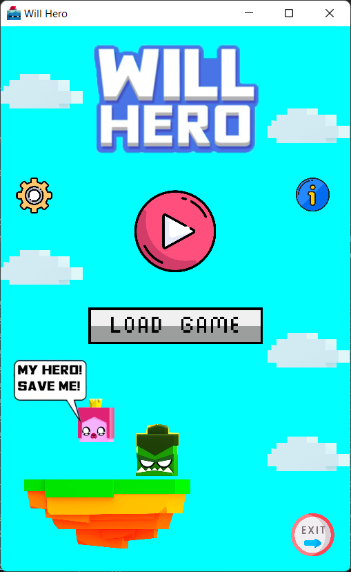
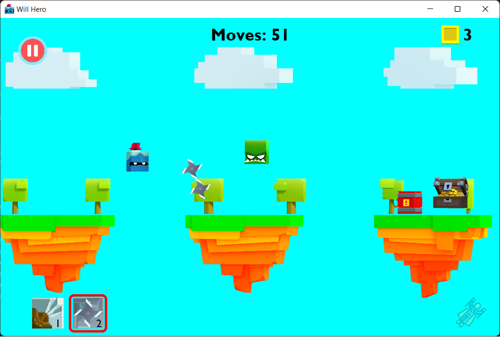
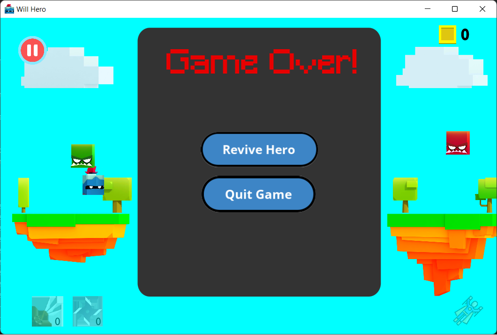
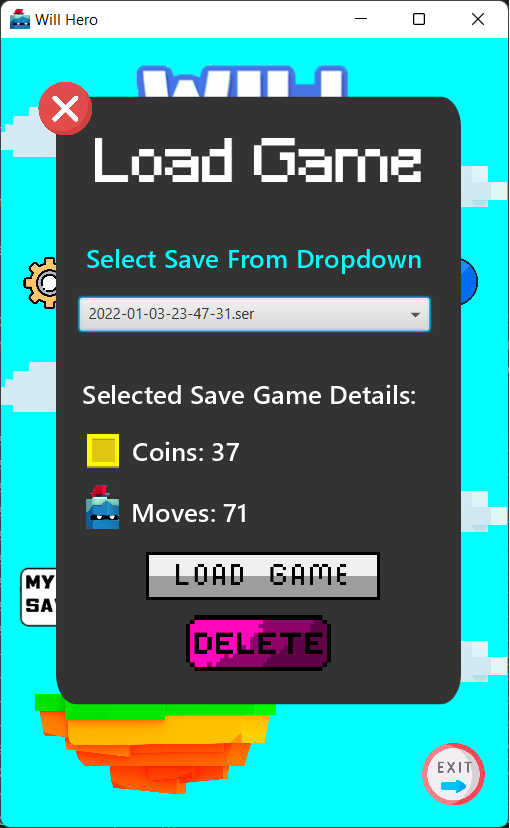
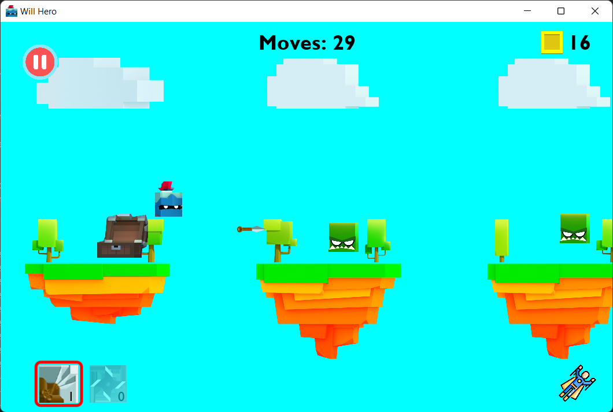
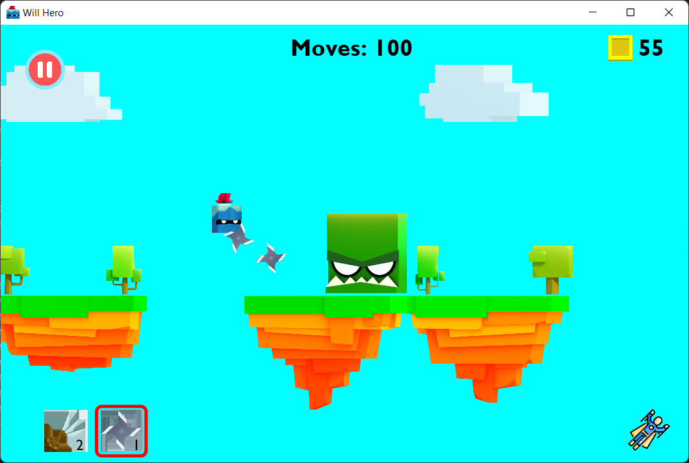
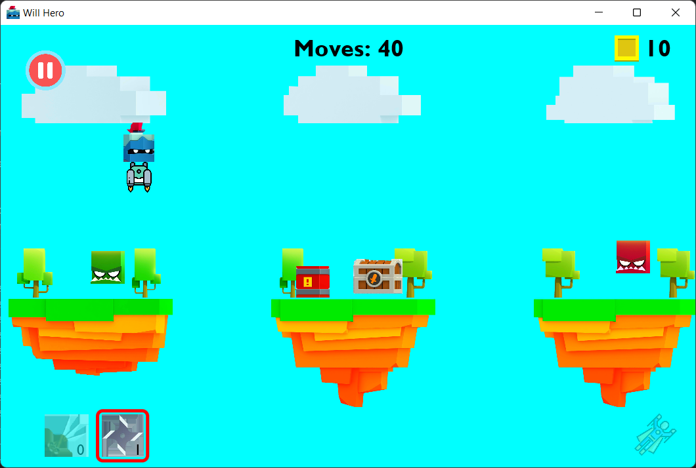
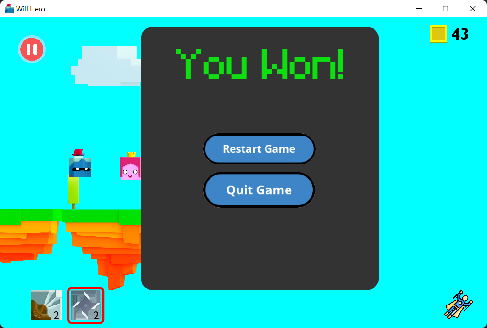

# Will Hero Game

## :rocket: Features
* Play a fun filled game, and try to save the Princess from the Boss Orc!
* Earn numerous coins and weapons along the way.
* Get past various Orcs and Obstacles.
* Get weapon upgrades via weapon chests and select your own weapon!
* Got Eliminated? Couldn't save the Princess? Fear not, as you can use your coins to revive your Hero back once more!
* Got busy in the middle of the game? Easily save your game and load back anytime you wish!

## :computer: Design and Implementation
* Event-Driven Programming & Object Oriented Programming concepts were used such as Polymorphism, Inheritance, Interfaces, Abstraction & Exception Handling.
* GUI effects via Animations such as Translations, Rotations & Timelines on the Weapons, Orcs & Hero for stunning visuals!
* Coordinates of different elements have been accessed and updated to change their positions as the game proceeds to give a seamless and smooth experience.

## :camera: Screenshots From The Game

 
 

 
 

 
 

 
 

 
 

 
 

 
 

